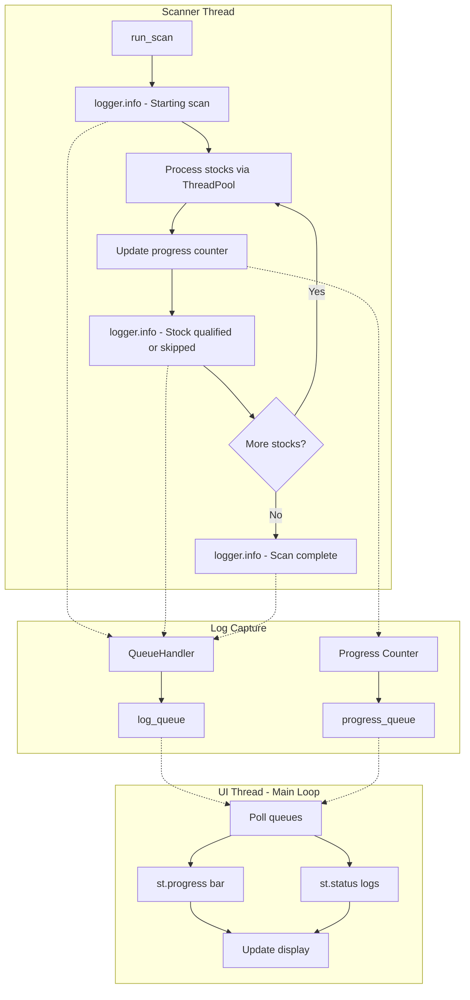

# Live Logging for Scanner UI - Implementation Plan

## Overview

Add real-time logging display with progress bar to the Scanner UI, allowing users to see actual scanner activity as it happens.

## Current State

- Scanner uses Python `logging` module for all progress messages
- UI blocks with a generic spinner during scan execution
- No visibility into scan progress or intermediate results

## Proposed Solution

### Architecture



### Components

#### 1. Log Capture Module - `ui/utils/log_capture.py`

```python
# Key classes:
# - QueueHandler: Captures log records into a queue
# - ScanProgress: Dataclass for progress updates
# - LogCapture: Context manager for capturing logs
```

**Responsibilities:**
- Capture scanner log messages into a thread-safe queue
- Track progress (stocks processed / total stocks)
- Provide clean API for UI to consume

#### 2. Scanner Modifications - `scanner/scanner.py`

**Changes needed:**
- Add optional `progress_callback` parameter to `run_scan()`
- Emit progress updates as each stock is processed
- Keep existing logging unchanged

```python
def run_scan(
    kite: KiteClient | None = None,
    max_candidates: int = MAX_CANDIDATES,
    min_score: float = MIN_SCORE,
    save_to_db: bool = True,
    progress_callback: Callable[[int, int, str], None] | None = None,  # NEW
) -> tuple[list[dict[str, Any]], str | None]:
```

#### 3. UI Updates - `ui/pages/scanner.py`

**Changes needed:**
- Replace `st.spinner()` with `st.status()` container
- Add `st.progress()` bar for visual progress
- Run scanner in background thread
- Poll for updates and refresh display

### UI Mockup

```
┌─────────────────────────────────────────────────────────────┐
│ 🔍 Scanner                                                  │
├─────────────────────────────────────────────────────────────┤
│ ⚙️ Scanner Settings                                         │
│ Min IVP: [50]    Min HV Rank: [50]    [🔄 Refresh Scanner]  │
│                                                             │
│ ┌─────────────────────────────────────────────────────────┐ │
│ │ 🔄 Scanning F&O Universe                                │ │
│ │                                                         │ │
│ │ Progress: 45/150 stocks (30%)                          │ │
│ │ ████████░░░░░░░░░░░░░░░░░░░░░░░░░░░░░░░░░░░░░ 30%      │ │
│ │                                                         │ │
│ │ ▼ Live Logs:                                           │ │
│ │   [12:30:01] ═══ Starting Scanner Run ═══              │ │
│ │   [12:30:02] Scanning 150 F&O stocks...                │ │
│ │   [12:30:05] ✓ RELIANCE — IVP = 72.0% | Trend: Bullish │ │
│ │   [12:30:08] ✓ TATAMOTORS — IVP = 65.0% | Trend: Bear  │ │
│ │   [12:30:10] Processing SBIN...                        │ │
│ │   ...                                                  │ │
│ └─────────────────────────────────────────────────────────┘ │
│                                                             │
│ ▶ Opportunities Found: 3                                    │
│   [Opportunity cards appear here after scan completes]      │
└─────────────────────────────────────────────────────────────┘
```

### Implementation Details

#### Progress Tracking Strategy

The scanner uses `ThreadPoolExecutor` for parallel processing, so we need thread-safe progress tracking:

1. Use `threading.Lock` for counter updates
2. Each completed future increments the counter
3. Progress = `processed / total_stocks`

#### Log Filtering

Only capture logs from scanner-related loggers:
- `scanner.scanner`
- `scanner.iv_scorer`
- `core.trend_detector`
- `core.iv_calculator`

#### Threading Model

```python
# In UI:
with st.status("Scanning F&O Universe...", expanded=True) as status:
    progress_bar = st.progress(0, text="Initializing...")
    log_container = st.empty()
    
    # Start scanner in background thread
    scanner_thread = Thread(target=run_scan_with_callbacks, args=[...])
    scanner_thread.start()
    
    # Poll for updates
    while scanner_thread.is_alive():
        # Update progress bar
        progress = progress_queue.get_nowait()
        progress_bar.progress(progress.pct, text=f"{progress.current}/{progress.total}")
        
        # Update logs
        logs = log_queue.get_nowait()
        log_container.code(logs)
        
        time.sleep(0.1)  # Small delay to prevent UI thrashing
    
    status.update(label="Scan Complete!", state="complete")
```

### Files to Modify

| File | Changes |
|------|---------|
| `ui/utils/log_capture.py` | **NEW** - Log capture utilities |
| `scanner/scanner.py` | Add progress_callback parameter |
| `ui/pages/scanner.py` | Replace spinner with status + progress bar |

### Testing Plan

1. Run scanner from UI and verify logs appear in real-time
2. Verify progress bar updates correctly
3. Test with different numbers of F&O stocks
4. Verify UI remains responsive during scan
5. Test error handling (API failures, etc.)

## Implementation Order

1. Create `ui/utils/log_capture.py` with QueueHandler and progress tracking
2. Modify `scanner/scanner.py` to accept and call progress callback
3. Update `ui/pages/scanner.py` to use new live logging display
4. Test end-to-end functionality
